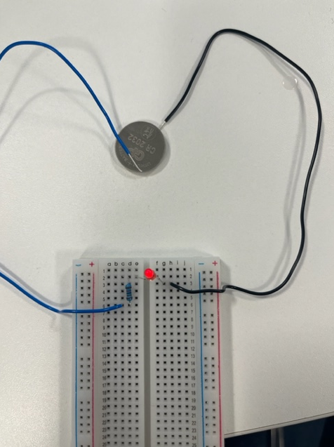
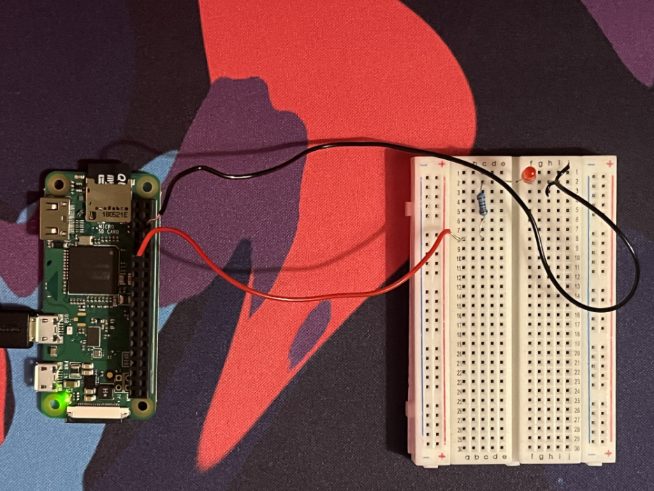
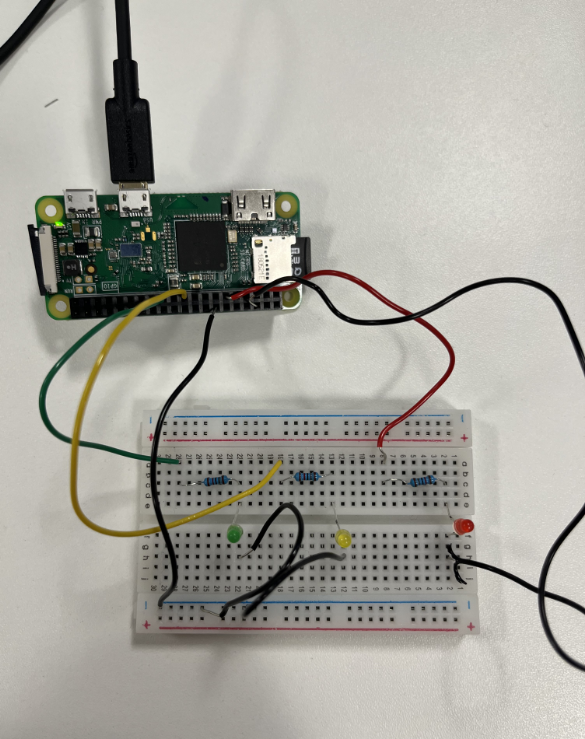
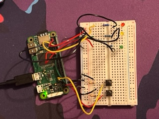
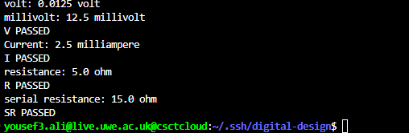

<h1 align="center"> LED Circuit </h1>

# *The circuit built is simple it consists of:*

-  A bread board 
-  LED Lights 
-  330  Ω Resistors
-  10K Ω Resistors
-  A coin cell battery 
-  Some solid core wires 
-  Raspberry Pi Board 
-  Micro USB cable 
-  A couple of buttons

# *(Task 1)*

We were required to use a bread board some wires and a resistor to power a RED LED, which was done as you can see below.

# *(Task 2)*

Task 2 was slightly more complicated since we were asked to use the raspberri pi as the power source for the circuit. 

# *(Task 3)*

Continued building off the circuit from task 2, two more LED lights were added and a resistor along which each LED.

 
 # *(Task 4)*
 
2 buttons were added onto the bread board they did:

if Button 1 was pressed once the LED sequence G -> Y -> R should occur 

if Button 1 was pressed twice it would change the direction of the sequence, for example :

button 1 was pressed while the sequence was on the Yellow LED the Green LED would light back on.

if Button 2 was pressed the LED sequence R -> Y -> G

# *Task 5* 

The two Task 5 files are programs that output the correct amount of volts, resistance, serial resistance and current and the code informs you if they passed the test or not.

